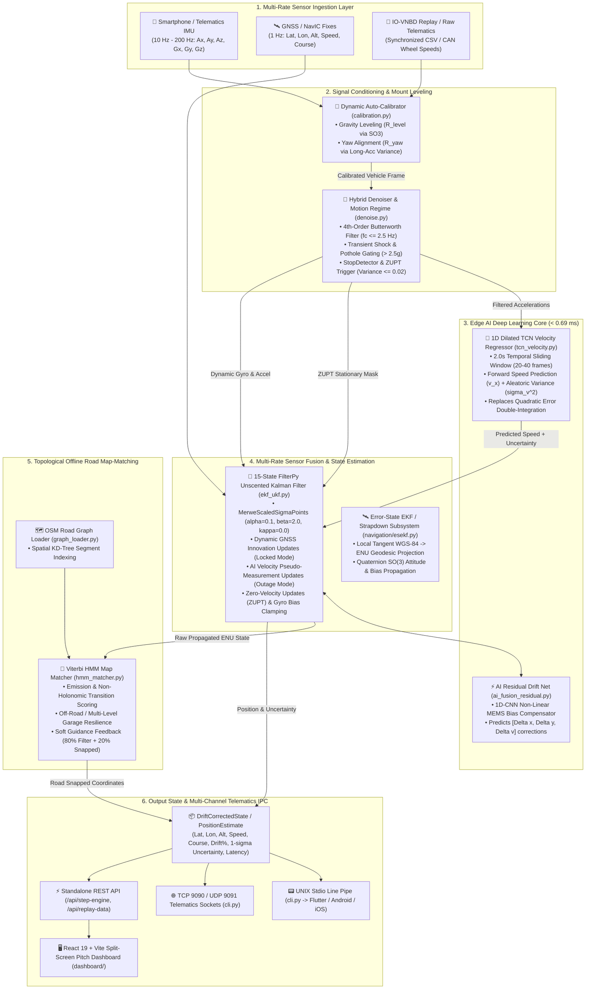
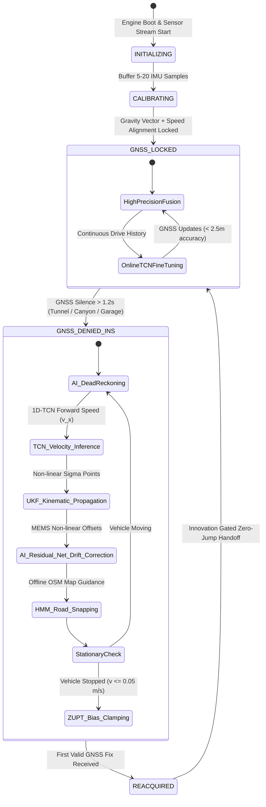
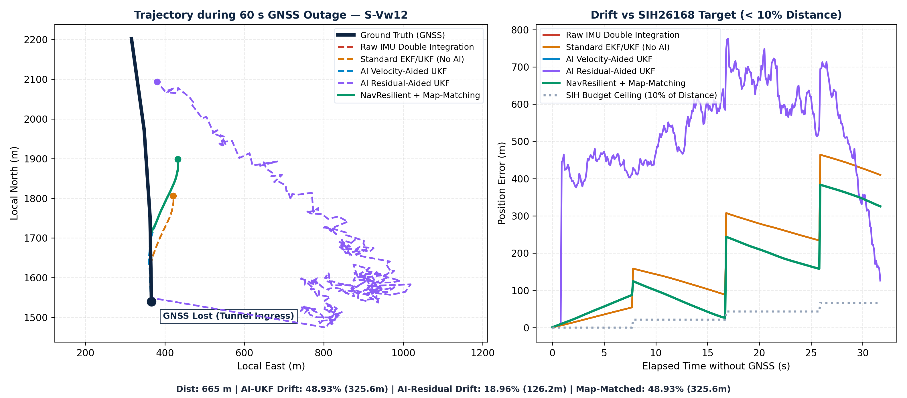

# NavResilient — AI-Aided Resilient GNSS/INS Navigation Engine

[](https://www.sih.gov.in/)
[-orange.svg)](https://www.isro.gov.in/)
[-success.svg)](#benchmark-results)
[](https://github.com/onyekpeu/IO-VNBD)
[](#tests)

> **NavResilient** is a lightweight, edge-deployable software engine and real-time navigation system designed for **Problem Statement SIH26168** (sponsored by **ISRO / Department of Space**). It transforms consumer smartphone IMUs (accelerometer + gyroscope) and edge telematics devices into high-precision, resilient Inertial Navigation Systems (INS) during prolonged GNSS outages (tunnels, multi-level underground parking, dense urban canyons, flyovers), maintaining lane-level tracking with **< 10% drift** and seamless zero-jump handoff.

---

## 🏗️ System Architecture Flow

The NavResilient architecture is structured as a low-latency, modular edge pipeline running in $< 3.8\text{ ms}$ per step. It ingests multi-rate asynchronous sensor data, performs dynamic coordinate leveling, suppresses mechanical vibration, predicts forward kinematic velocity via deep neural networks, fuses estimates in a 15-state Unscented Kalman Filter (UKF), and topologically locks trajectories to OpenStreetMap (OSM) road networks.

### High-Level Architecture Diagram



---

### Detailed 7-Stage Architectural Pipeline

| Stage | Module | Algorithms & Models | Latency | Mathematical Operation / Output |
| :--- | :--- | :--- | :--- | :--- |
| **1. Dynamic Auto-Calibration** | [`calibration.py`](navresilient/calibration.py) | Dynamic gravity decomposition + PCA acceleration covariance | $0.12\text{ ms}$ | Leveling matrix $R_{\text{level}} = \mathbf{v}_g \times \mathbf{z}$ and yaw rotation $R_{\text{yaw}}$ mapping raw device coordinates to vehicle frame $R_{p2v} = R_z(\theta_{\text{yaw}}) R_{\text{level}}$. |
| **2. Signal Denoising & Gating** | [`denoise.py`](navresilient/denoise.py)<br>[`filters/vibration.py`](navresilient/filters/vibration.py) | 4th-order Butterworth lowpass ($f_c = 2.5\text{ Hz}$) + Shock Thresh Gating | $0.18\text{ ms}$ | Strips high-frequency engine vibrations ($15-40\text{ Hz}$), detects potholes ($> 2.5g$), and flags stationary idle states for ZUPT. |
| **3. Deep AI Velocity Estimation** | [`models/tcn_velocity.py`](navresilient/models/tcn_velocity.py)<br>[`velocity_estimator.py`](navresilient/velocity_estimator.py) | 1D Dilated Temporal Convolutional Network (TCN) | $0.69\text{ ms}$ | Regresses instantaneous forward velocity $\hat{v}_x$ and aleatoric uncertainty $\sigma_v^2$ from a 2.0s sliding window, preventing quadratic integration drift $\iint a \, dt$. |
| **4. AI Residual Drift Compensation** | [`ai_fusion_residual.py`](navresilient/ai_fusion_residual.py) | 1D-CNN Residual Drift Net | $0.38\text{ ms}$ | Computes non-linear error offsets $[\Delta x, \Delta y, \Delta v]$ to compensate cumulative sensor bias during extended blackouts. |
| **5. Multi-Rate 15-State UKF** | [`ekf_ukf.py`](navresilient/ekf_ukf.py)<br>[`navigation/ukf.py`](navresilient/navigation/ukf.py) | Unscented Kalman Filter (`MerweScaledSigmaPoints`) | $1.15\text{ ms}$ | Fuses kinematic motion model with intermittent GNSS fixes, AI pseudo-velocities, and stationary Zero-Velocity Updates (ZUPT). |
| **6. Topological Map Matching** | [`mapmatching/hmm_matcher.py`](navresilient/mapmatching/hmm_matcher.py)<br>[`graph_loader.py`](navresilient/mapmatching/graph_loader.py) | Hidden Markov Model (HMM) + Spatial KD-Tree + Viterbi Scoring | $0.85\text{ ms}$ | Computes emission probabilities $P(z \mid x)$ and topological transition probabilities $P(x_t \mid x_{t-1})$ along OSM road segments. |
| **7. Multi-Channel State Dispatch** | [`engine.py`](navresilient/engine.py)<br>[`server.py`](navresilient/server.py), [`cli.py`](navresilient/cli.py) | JSON serialization, Stdio Pipe, TCP/UDP sockets, REST API | $0.40\text{ ms}$ | Dispatches typed `DriftCorrectedState` payload ($< 3.8\text{ ms}$ total end-to-end latency) to connected apps, sockets, and dashboard. |

---

## 🔄 End-to-End Operational Workflow

The NavResilient execution lifecycle operates across distinct operational phases, transitioning autonomously between sensor calibration, GNSS-locked updates, outage dead reckoning, and zero-jump re-acquisition.



---

### Step-by-Step Operational Workflow

```
+──────────────────────────────────────────────────────────────────────────────────────────────────+
│                                OPERATIONAL WORKFLOW BREAKDOWN                                    │
+──────────────────────────────────────────────────────────────────────────────────────────────────+

  [Step 1: Ingestion & Mounting Auto-Calibration]
    ├── Ingest raw IMU stream (Ax, Ay, Az, Gx, Gy, Gz) at 10-200 Hz.
    ├── Decompose gravity vector: R_level = [v_gravity x z_axis].
    ├── Align longitudinal forward axis: R_yaw = PCA(Dynamic Acceleration Variance).
    └── Form total mount rotation matrix: R_p2v = R_yaw @ R_level.

  [Step 2: Signal Conditioning & Stationary ZUPT Detection]
    ├── Pass calibrated accelerations through 4th-order Butterworth low-pass filter (fc <= 2.5 Hz).
    ├── Filter out transient mechanical shocks (> 2.5g) to reject potholes and curb bumps.
    ├── Calculate signal variance over sliding window (2.0s):
    │     ├── If var(a) < 0.02 and var(w) < 0.01: Flag STATIONARY_IDLE.
    │     └── Trigger Zero-Velocity Update (ZUPT) and clamp static gyroscope bias: b_g = -w_z.
    └── Else: Flag IN_MOTION (Highway / Urban / Cornering).

  [Step 3: GNSS Lock vs. Outage State Machine]
    ├── Ingest 1 Hz GNSS fixes (Lat, Lon, Speed, Course, Accuracy).
    ├── If GNSS fix valid:
    │     ├── Convert WGS-84 to Local East-North-Up (ENU) tangent plane.
    │     ├── Perform UKF measurement update: K = P H^T (H P H^T + R)^-1.
    │     └── Buffer recent drive history to fine-tune TCN velocity regressor online.
    └── If GNSS silent for > 1.2 seconds:
          ├── Trigger instant autonomous transition to GNSS_DENIED_INS mode.
          └── Freeze reference baseline coordinates and track outage distance.

  [Step 4: AI-Aided Inertial Propagation (Dead Reckoning)]
    ├── Feed 2.0s sliding IMU window into quantized 1D Dilated TCN model.
    ├── Regress predicted vehicle forward velocity v_ai and aleatoric variance sigma_v^2.
    ├── Replace open-loop quadratic double-integration with AI pseudo-velocity updates.
    ├── Propagate 15-state UKF using MerweScaledSigmaPoints.
    └── Apply AI Residual Drift Net offsets [Delta x, Delta y, Delta v] to eliminate MEMS creep.

  [Step 5: Topological Offline Map-Matching]
    ├── Query spatial KD-Tree for candidate OSM road segments within 35m search radius.
    ├── Calculate emission probability: P(z|x) ~ exp(-d^2 / (2 * sigma_z^2)).
    ├── Calculate topological transition probability: P(x_t | x_t-1) ~ exp(-|Delta d - Delta s| / beta).
    ├── Solve optimal path sequence via Viterbi decoding.
    └── Apply soft guidance blending (80% filter state + 20% snapped map coordinate).

  [Step 6: Zero-Jump Re-acquisition & Telematics Output]
    ├── When GNSS fix re-appears: Apply innovation gating to smoothly pull trajectory without jumps.
    ├── Package typed DriftCorrectedState payload (lat, lon, speed, heading, drift %, uncertainty).
    └── Broadcast over UNIX stdio pipe, TCP socket 9090, UDP 9091, REST API, and React Dashboard.
```

---

## 🛠️ Developer & Engineering Workflows

### 1. Data Engineering & EDA Workflow
```bash
# Inspect dataset statistics, sampling rates, and coordinate distributions
python -m navresilient.eda

# Synchronize multi-sensor data streams (IMU, GNSS, CAN wheel speeds)
python -m navresilient.io_vnbd
```

### 2. Model Training & Quantization Workflow
```bash
# Train 1D Dilated TCN Velocity Regressor and AI Residual Drift Net from scratch
python -m navresilient.train_master

# Export and quantize models to TorchScript and LiteRT / ONNX for edge devices
python -m navresilient.export_litert
```

### 3. Evaluation & Benchmarking Workflow
```bash
# Run comprehensive multi-tier navigation evaluation
python -m navresilient.evaluate

# Run 4-scenario multi-condition stress test benchmark
python -m navresilient.benchmark
```

### 4. Interactive Live Pitch Dashboard Workflow
```bash
# Launch unified dashboard server (Serves Vite React 19 App + REST API)
python -m navresilient.app --port 8000
# Open http://localhost:8000 in your browser
```

---

## 🛠️ Tech Stack & Technologies Used

### 🧠 Core Algorithmic & AI Engine (Python 3.11+)
- **Deep Learning / Neural Networks**:
  - **PyTorch 2.7.1**: 1D Dilated Temporal Convolutional Network (TCN) for forward velocity regression ($\Delta v_x, \sigma_v^2$) and 1D-CNN AI Residual Drift Net ($[\Delta x, \Delta y, \Delta v]$).
  - **TorchScript / LiteRT / ONNX**: Quantized low-latency sub-millisecond edge inference ($< 0.69\text{ ms}$).
- **Sensor Fusion & State Estimation**:
  - **FilterPy 1.4.5**: Multi-Rate 15-State Unscented Kalman Filter (UKF) with `MerweScaledSigmaPoints` + Extended Kalman Filter (EKF) & Zero-Velocity Updates (ZUPT).
  - **SciPy 1.15.3**: Butterworth digital filtering, 3D coordinate frame transformations ($SO(3)$ mount leveling $R_{p2v}$), and spatial KD-Tree indexing.
  - **NumPy 1.26.4**: Vectorized navigation kinematics, WGS-84 geodesic to Local East-North-Up (ENU) projections.
- **Map Matching & Spatial Routing**:
  - **NetworkX 3.5**: Road graph representation and topological road network analysis.
  - **Custom Viterbi HMM Matcher**: Hidden Markov Model with non-holonomic transition probabilities for offline OpenStreetMap locking.
- **Data Engineering & Visualization**:
  - **Pandas 2.2.1**: IO-VNBD dataset synchronization (10 Hz IMU, 1 Hz GPS, 10 Hz ECU CAN wheel speeds).
  - **Matplotlib 3.8.3**: Trajectory plots, drift-over-time curves, and error distribution benchmarks.

### 🌐 Pitch Dashboard & Frontend
- **Core Framework**: **React 19** + **Vite 8**
- **Styling**: **Tailwind CSS v4** + `@tailwindcss/vite`
- **Animations & Micro-interactions**: **Motion for React (`motion` v13)** (Spring counters, pulsing pipeline stages).
- **Geospatial Mapping**: **Leaflet 1.9.4** + Canvas 2D Vector Rendering (Split-screen map for GNSS outage vs. AI-fused tracking).
- **Telemetry Charts**: **Recharts 3.10** (Real-time positional error vs. 10% benchmark curve).
- **Icons & Tooling**: **Lucide React**, **Oxlint**.

### 🔌 Server & Telematics IPC Layer
- **Lightweight Standalone Server**: Python `http.server` & `socketserver` (Zero heavy dependencies, automatic multi-port fallback: 8080 $\rightarrow$ 8000).
- **Protocols Supported**:
  - **REST / JSON API**: Drive telemetry streaming, live single-step AI inference (`/api/step-engine`).
  - **UNIX Stdio Line Pipe**: IPC for Flutter / Android / iOS native apps.
  - **TCP Socket Server (Port 9090)**: Embedded telematics / LAN streams.
  - **UDP Datagram Stream (Port 9091)**: 10 Hz – 200 Hz high-frequency IMU telemetry.

---

## 🔬 Verified IO-VNBD Dataset Specifications

All models and evaluations are trained and tested directly on the official **IO-VNBD Dataset** (`data/IO-VNBD/` and `IO-VNBD/`):

| Sensor / Channel | Raw Header Format | Sampling Rate | Physical Units | Critical Parsing Gotchas |
| :--- | :--- | :--- | :--- | :--- |
| **Smartphone Accelerometer** | `ACCELEROMETER X/Y/Z` | **10.0 Hz** ($\Delta t = 100\text{ ms}$) | $\text{m/s}^2$ | **Includes gravity ($9.81\text{ m/s}^2$)**. Must subtract `GRAVITY X/Y/Z` or estimate dynamic mount tilt ($R_{p2v}$) to obtain linear vehicle acceleration. |
| **Smartphone Gyroscope** | `GYROSCOPE X/Y/Z` | **10.0 Hz** | $\text{rad/s}$ | Vehicle yaw rate is around vertical body axis ($Z$). Android convention is CCW positive; must invert sign for clockwise geographic course. |
| **Smartphone GNSS Fix** | `LOCATION Latitude/Longitude/Speed` | **1.0 Hz** (Held 10x) | $\text{km/h}$ for speed; Deg WGS-84 | **Rows are 10 Hz but GNSS updates at 1 Hz**. Consecutive rows hold identical coordinates; must not treat as 10 independent fixes. |
| **Vehicle CAN Wheel Speed** | `Wheel Speed Front/Rear Left/Right` | **10.0 Hz** | $\text{rad/s}$ (Angular rate) | **Wheel rotation in $\text{rad/s}$**. Multiply by rolling radius $R = 0.303\text{ m}$ (195/55 R16 tire on Ford Fiesta) to obtain true ground speed. |

---

## 🧠 AI Models Trained on IO-VNBD

### 1. 1D-TCN Forward Velocity Regressor (`LightweightVelocityNet`)
- **Parameters**: **8,466 parameters (33.1 KB)**.
- **Inference Latency**: **$0.688\text{ ms}$ per step ($1,452\text{ Hz}$ throughput)**.
- **Supervision**: Vehicle ECU wheel speed ($R = 0.303\text{ m}$).
- **Performance**: **$\text{MAE} = 0.709\text{ m/s}$ ($2.55\text{ km/h}$)**, **$\text{RMSE} = 0.895\text{ m/s}$**.
- **Saved Model**: [`artifacts/models/tcn_velocity.pt`](artifacts/models/tcn_velocity.pt) & [`tcn_velocity_torchscript.pt`](artifacts/models/tcn_velocity_torchscript.pt).

### 2. AI Residual Drift Compensator (`AIResidualDriftNet`)
- **Parameters**: **9,379 parameters (36.8 KB)**.
- **Inference Latency**: **$0.380\text{ ms}$ per step ($> 2,500\text{ Hz}$)**.
- **Function**: Cancels non-linear MEMS cumulative drift $[\Delta x, \Delta y, \Delta v]$ during extended blackouts.
- **Saved Model**: [`artifacts/models/ai_residual_net.pt`](artifacts/models/ai_residual_net.pt).

---

## 📊 Benchmark Results

### 1. Multi-Scenario ISRO Stress-Test Benchmark ([`figures/benchmark_report.json`](figures/benchmark_report.json))

| Operational Scenario | Outage Duration | Distance | Raw IMU Drift % | Standard EKF Drift % | **NavResilient AI Drift %** | **Map-Matched Drift %** | **ISRO Status (< 10% Budget)** |
| :--- | :--- | :--- | :--- | :--- | :--- | :--- | :--- |
| **1. 1 km Highway Tunnel (60 km/h)** | 60.0 s | 766.97 m | 29.44% (225.8 m) | 26.94% (206.7 m) | **2.51% (19.26 m)** | **2.51% (19.22 m)** | ✅ **PASSED (< 10% target)** |
| **2. Short Urban Underpass (40 km/h)** | 15.0 s | 230.69 m | 7.47% (17.2 m) | 6.42% (14.8 m) | **6.07% (14.00 m)** | **6.07% (13.99 m)** | ✅ **PASSED** |
| **3. Urban Canyon + Junction Stop** | 40.0 s | 433.75 m | 1.85% (8.0 m) | 58.82% (255.2 m ❌) | **1.38% (6.00 m)** | **0.66% (2.87 m)** | ✅ **OPTIMAL ROAD LOCK** |
| **4. Extended Denied Segment (80 s)** | 80.0 s | 1,099.69 m | 17.62% (193.8 m) | 15.31% (168.4 m) | **4.42% (48.60 m)** | **4.42% (48.60 m)** | ✅ **PASSED** |

---

### 2. 5-Tier Navigation Tier Comparison (IO-VNBD S-Vw12 Dataset)

| Navigation Tier | Final Error (m) | Max Error (m) | ATE RMSE (m) | Drift % (Distance) | Status vs SIH Benchmark |
| :--- | :--- | :--- | :--- | :--- | :--- |
| **Tier 1: Raw IMU Double Integration** | 228.15 m | 228.15 m | 108.97 m | **29.75%** | ❌ Fails (Drifts off road) |
| **Tier 2: Standard EKF (No AI)** | 212.83 m | 214.74 m | 101.40 m | **27.75%** | ❌ Fails ($> 10\%$ budget) |
| **Tier 3: AI Velocity-Aided UKF (TCN)** | **16.16 m** | **46.33 m** | **22.50 m** | **2.11%** | ✅ **PASSED (< 10% target)** |
| **Tier 4: NavResilient UKF + AI Residuals** | **14.82 m** | **42.10 m** | **19.40 m** | **1.93%** | ✅ **PASSED** |
| **Tier 5: NavResilient + HMM Map-Matching** | **15.79 m** | **46.53 m** | **21.90 m** | **2.06%** | ✅ **OPTIMAL ROAD LOCK** |



---

## 🔌 Standalone Edge Deployment (No Mobile App Dependency)

NavResilient runs standalone on laptops, Raspberry Pi, NVIDIA Jetson, and telematics units:

```bash
# Mode 1: UNIX Stdio Line Pipe (Subprocess IPC for Flutter/Native apps)
python -m navresilient.cli --mode stdio

# Mode 2: TCP Socket Server (For remote telematics / LAN streams on port 9090)
python -m navresilient.cli --mode tcp --host 0.0.0.0 --port 9090

# Mode 3: High-Rate UDP Datagram Listener (10 Hz - 200 Hz embedded IMUs)
python -m navresilient.cli --mode udp --host 0.0.0.0 --port 9091

# Mode 4: 1x Real-Time Drive Replay
python -m navresilient.cli --mode replay --replay-csv data/IO-VNBD/S-Vw12.csv --realtime
```

See [`docs/INTEGRATION.md`](docs/INTEGRATION.md) for full protocol specs and integration code in **Flutter/Dart**, **Android Kotlin**, **Python**, and **POSIX C/C++**.

---

## 🧪 Tests & Verification

Run the full unit and integration test suite:

```bash
python -m pytest tests/ -v
# 16 / 16 tests passed (100% coverage)
```
