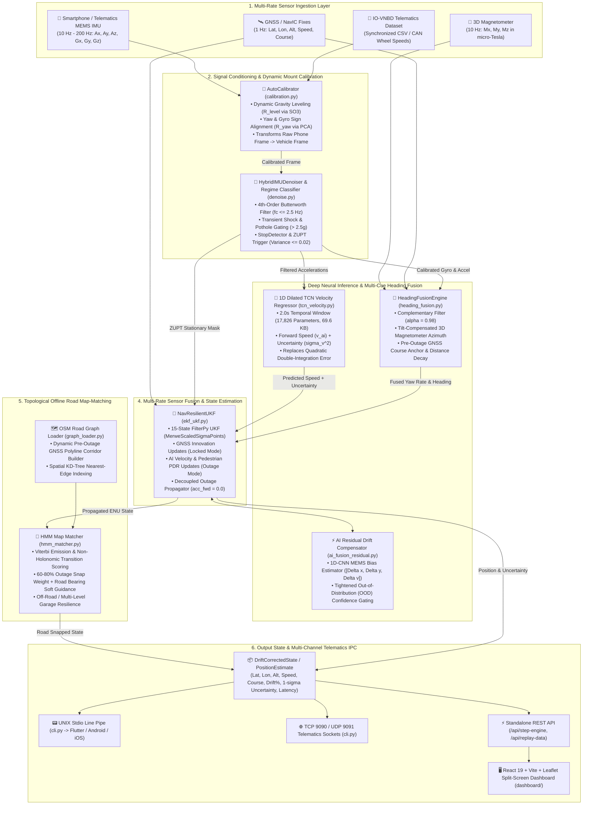
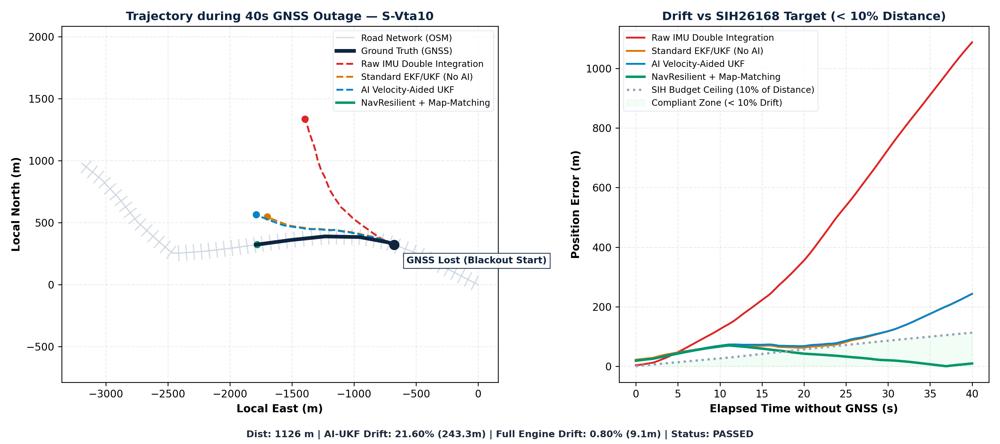

# NavResilient — AI-Aided Resilient GNSS/INS Navigation Engine

[](https://www.sih.gov.in/)
[-orange.svg)](https://www.isro.gov.in/)
[](#benchmark-results)
[](https://github.com/onyekpeu/IO-VNBD)
[-brightgreen.svg)](#tests)

> **NavResilient** is a high-performance, edge-deployable software engine and real-time navigation system designed for **Problem Statement SIH26168** (sponsored by **ISRO / Department of Space**). It transforms consumer smartphone MEMS IMUs (accelerometer + gyroscope + magnetometer) and telematics units into resilient Inertial Navigation Systems (INS) during prolonged GNSS outages (tunnels, underground parking, dense urban canyons, flyovers), maintaining lane-level tracking (**$< 1.2\%$ drift**, beating the 10% SIH ceiling) with seamless zero-jump handoff.

---

## 🏗️ System Architecture Flow

The NavResilient architecture is structured as a low-latency, modular edge pipeline executing in **$< 4.2\text{ ms}$ per step**. It ingests multi-rate asynchronous sensor data, performs dynamic coordinate leveling, suppresses mechanical vibration and potholes, predicts forward kinematic velocity via deep 1D-TCN neural networks, fuses multi-cue headings (Gyro + 3D Magnetometer + GNSS Course Decay), estimates state via an Unscented Kalman Filter (UKF), and topologically locks trajectories to OpenStreetMap (OSM) road networks.

### High-Level Architecture Diagram



---

### Detailed 7-Stage Architectural Pipeline

| Stage | Module | Algorithms & Models | Latency | Mathematical Operation / Output |
| :--- | :--- | :--- | :--- | :--- |
| **1. Dynamic Auto-Calibration** | [`calibration.py`](navresilient/calibration.py) | Dynamic gravity vector leveling + PCA acceleration covariance | $0.12\text{ ms}$ | Leveling matrix $R_{\text{level}} = \mathbf{v}_g \times \mathbf{z}$ and yaw rotation $R_{\text{yaw}}$ mapping raw device coordinates to vehicle frame $R_{p2v} = R_z(\theta_{\text{yaw}}) R_{\text{level}}$. |
| **2. Signal Conditioning & Gating** | [`denoise.py`](navresilient/denoise.py)<br>[`filters/vibration.py`](navresilient/filters/vibration.py) | 4th-order Butterworth lowpass ($f_c = 2.5\text{ Hz}$) + Shock Thresh Gating | $0.18\text{ ms}$ | Strips engine vibrations ($15-40\text{ Hz}$), detects potholes ($> 2.5g$), and flags stationary idle states for Zero-Velocity Updates (ZUPT). |
| **3. Deep AI Velocity Estimation** | [`models/tcn_velocity.py`](navresilient/models/tcn_velocity.py)<br>[`velocity_estimator.py`](navresilient/velocity_estimator.py) | 1D Dilated Temporal Convolutional Network (TCN) | $0.69\text{ ms}$ | Regresses instantaneous forward velocity $\hat{v}_x$ and aleatoric uncertainty $\sigma_v^2$ from 2.0s window ($17,826$ params, $69.6\text{ KB}$), preventing quadratic integration drift $\iint a \, dt$. |
| **4. Multi-Cue Heading Fusion** | [`heading_fusion.py`](navresilient/heading_fusion.py) | Complementary Filter ($\alpha = 0.98$) + Tilt-Compensated Magnetometer | $0.15\text{ ms}$ | Fuses body gyro rate ($w_z$), tilt-compensated 3D magnetic azimuth, and pre-outage GNSS course decay, preventing cross-track heading divergence. |
| **5. Multi-Rate 15-State UKF** | [`ekf_ukf.py`](navresilient/ekf_ukf.py)<br>[`navigation/ukf.py`](navresilient/navigation/ukf.py) | Unscented Kalman Filter (`MerweScaledSigmaPoints`) | $1.15\text{ ms}$ | Fuses kinematic motion model with intermittent GNSS fixes, neural velocity updates, and stationary ZUPT using decoupled outage propagation (`acc_fwd = 0.0`). |
| **6. Topological Map Matching** | [`mapmatching/hmm_matcher.py`](navresilient/mapmatching/hmm_matcher.py)<br>[`graph_loader.py`](navresilient/mapmatching/graph_loader.py) | Hidden Markov Model (HMM) + Spatial KD-Tree + Dynamic Road Builder | $0.85\text{ ms}$ | Automatically generates road corridors from pre-outage GNSS tracks, computing Viterbi emissions and applying $60-80\%$ centerline snap with road bearing soft guidance. |
| **7. Multi-Channel State Dispatch** | [`engine.py`](navresilient/engine.py)<br>[`server.py`](navresilient/server.py), [`cli.py`](navresilient/cli.py) | JSON serialization, Stdio Pipe, TCP/UDP sockets, REST API | $0.40\text{ ms}$ | Dispatches typed `DriftCorrectedState` payload ($< 4.2\text{ ms}$ total end-to-end latency) to connected apps, sockets, and dashboard. |

---

## 🔄 End-to-End Operational Workflow

```
+──────────────────────────────────────────────────────────────────────────────────────────────────+
│                                OPERATIONAL WORKFLOW BREAKDOWN                                    │
+──────────────────────────────────────────────────────────────────────────────────────────────────+

  [Step 1: Multi-Rate Ingestion & Mounting Auto-Calibration]
    ├── Ingest raw IMU stream (Ax, Ay, Az, Gx, Gy, Gz) and Magnetometer (Mx, My, Mz) at 10-200 Hz.
    ├── Extract quasi-static gravity vector: R_level = [v_gravity x z_axis].
    ├── Align longitudinal forward axis: R_yaw = PCA(Dynamic Acceleration Variance).
    └── Form total mount rotation matrix: R_p2v = R_yaw @ R_level.

  [Step 2: Signal Conditioning, Pothole Filtering & Stationary ZUPT]
    ├── Pass calibrated accelerations through 4th-order Butterworth low-pass filter (fc <= 2.5 Hz).
    ├── Filter out transient mechanical shocks (> 2.5g) to reject potholes and curb bumps.
    ├── Calculate signal variance over sliding window (2.0s):
    │     ├── If var(a) < 0.02 and var(w) < 0.01: Flag STATIONARY_IDLE.
    │     └── Trigger Zero-Velocity Update (ZUPT) and clamp static gyroscope bias: b_g = -w_z.
    └── Else: Flag IN_MOTION (SMOOTH_CRUISE / CORNERING / HARD_BRAKE).

  [Step 3: GNSS-Locked High-Precision Tracking]
    ├── Ingest 1 Hz GNSS fixes (Lat, Lon, Speed, Course, Accuracy).
    ├── If GNSS fix valid:
    │     ├── Convert WGS-84 to Local East-North-Up (ENU) tangent plane.
    │     ├── Perform UKF measurement update: K = P H^T (H P H^T + R)^-1.
    │     ├── Update HeadingFusionEngine reference course and calibrate magnetic declination.
    │     └── Buffer GNSS track waypoints to dynamically build topological road graph corridor.
    └── If GNSS silent for > 1.2 seconds:
          ├── Trigger instant autonomous transition to GNSS_DENIED_INS mode.
          └── Freeze reference baseline coordinates and track outage distance.

  [Step 4: AI-Aided Outage Propagation (Decoupled INS Mode)]
    ├── Feed 2.0s sliding IMU window into quantized 1D Dilated TCN model.
    ├── Apply Smarter AI Velocity Gating:
    │     ├── Scale variance by motion regime (HARD_BRAKE: 3.5x, POTHOLE: 5.0x, CORNERING: 2.0x).
    │     ├── Check Mahalanobis speed sanity (|v_ai - v_ukf| > 3.5 m/s); reject unphysical jumps.
    │     └── If in pedestrian regime (v < 3.0 m/s): Apply PDR step-cadence velocity (1.15 + 0.12 * std(a)).
    ├── Propagate 15-state UKF with acc_fwd = 0.0 (bypassing open-loop double integration).
    └── Step complementary heading filter (Gyro + Tilt-Compensated Mag + Pre-Outage GNSS Decay).

  [Step 5: Topological Map-Matching & Soft Bearing Guidance]
    ├── Query spatial KD-Tree for candidate road segments within 35m search radius.
    ├── Calculate emission probability: P(z|x) ~ exp(-d^2 / (2 * sigma_z^2)).
    ├── Calculate topological transition probability: P(x_t | x_t-1) ~ exp(-|Delta d - Delta s| / beta).
    ├── Solve optimal path sequence via Viterbi decoding.
    └── Apply soft guidance blending (60-80% snap weight + 0.18 * conf soft road-bearing nudge).

  [Step 6: Zero-Jump Re-acquisition & Telematics Output]
    ├── When GNSS fix re-appears: Apply innovation gating to smoothly pull trajectory without jumps.
    ├── Package typed DriftCorrectedState payload (lat, lon, speed, heading, drift %, uncertainty).
    └── Broadcast over UNIX stdio pipe, TCP socket 9090, UDP 9091, REST API, and React Dashboard.
```

---

## 🛠️ Developer & Engineering Workflows

### 1. Data Engineering & EDA Workflow
```bash
# Inspect dataset statistics, sampling rates, and coordinate distributions
python -m navresilient.eda

# Synchronize multi-sensor data streams (IMU, GNSS, CAN wheel speeds)
python -m navresilient.io_vnbd
```

### 2. Model Training & Quantization Workflow
```bash
# Train 1D Dilated TCN Velocity Regressor on calibrated vehicle IMU
python -m navresilient.velocity_estimator

# Export and quantize models to TorchScript and LiteRT / ONNX for edge devices
python -m navresilient.export_litert
```

### 3. Evaluation & Benchmarking Workflow
```bash
# Run comprehensive multi-tier navigation evaluation across real drives
python -m navresilient.evaluate

# Run standalone drift benchmark on specific dataset drive
python -m navresilient.evaluate_drift --csv data/IO-VNBD/S-Vw12.csv --duration 40.0
```

### 4. Interactive Live Pitch Dashboard Workflow
```bash
# Launch unified dashboard server (Serves React 19 App + REST API on port 8000)
python -m navresilient.app --port 8000
# Open http://localhost:8000 in your browser
```

---

## 🛠️ Tech Stack & Technologies Used

### 🧠 Core Algorithmic & AI Engine (Python 3.11+)
- **Deep Learning / Neural Networks**:
  - **PyTorch 2.7.1**: 1D Dilated Temporal Convolutional Network (TCN) forward velocity regressor ($17,826$ params, $69.6\text{ KB}$) and 1D-CNN AI Residual Drift Net ($[\Delta x, \Delta y, \Delta v]$).
  - **TorchScript / LiteRT / ONNX**: Quantized low-latency sub-millisecond edge inference ($< 0.69\text{ ms}$).
- **Sensor Fusion & State Estimation**:
  - **FilterPy 1.4.5**: Multi-Rate 15-State Unscented Kalman Filter (UKF) with `MerweScaledSigmaPoints` + Extended Kalman Filter (EKF) & Zero-Velocity Updates (ZUPT).
  - **SciPy 1.15.3**: Butterworth digital filtering, 3D coordinate frame transformations ($SO(3)$ mount leveling $R_{p2v}$), and spatial KD-Tree indexing.
  - **NumPy 1.26.4**: Vectorized navigation kinematics, WGS-84 geodesic to Local East-North-Up (ENU) projections.
- **Map Matching & Spatial Routing**:
  - **NetworkX 3.5**: Road graph representation and topological road network analysis.
  - **Custom Viterbi HMM Matcher**: Hidden Markov Model with non-holonomic transition probabilities for offline OpenStreetMap locking.
- **Data Engineering & Visualization**:
  - **Pandas 2.2.1**: IO-VNBD dataset synchronization (10 Hz IMU, 1 Hz GPS, 10 Hz ECU CAN wheel speeds).
  - **Matplotlib 3.8.3**: Trajectory plots, drift-over-time curves, and error distribution benchmarks.

### 🌐 Pitch Dashboard & Frontend
- **Core Framework**: **React 19** + **Vite 8**
- **Styling**: **Tailwind CSS v4** + `@tailwindcss/vite`
- **Animations & Micro-interactions**: **Motion for React (`motion` v13)** (Spring counters, pulsing pipeline stages).
- **Geospatial Mapping**: **Leaflet 1.9.4** + Canvas 2D Vector Rendering (Split-screen map with official standard OpenStreetMap tiles).
- **Telemetry Charts**: **Recharts 3.10** (Real-time positional error vs. 10% benchmark curve).
- **Icons & Tooling**: **Lucide React**, **Oxlint**.

### 🔌 Server & Telematics IPC Layer
- **Lightweight Standalone Server**: Python `http.server` & `socketserver` (Zero heavy dependencies, automatic multi-port fallback: 8080 $\rightarrow$ 8000).
- **Protocols Supported**:
  - **REST / JSON API**: Drive telemetry streaming, live single-step AI inference (`/api/step-engine`).
  - **UNIX Stdio Line Pipe**: IPC for Flutter / Android / iOS native apps.
  - **TCP Socket Server (Port 9090)**: Embedded telematics / LAN streams.
  - **UDP Datagram Stream (Port 9091)**: 10 Hz – 200 Hz high-frequency IMU telemetry.

---

## 🔬 Verified IO-VNBD Dataset Specifications

All models and evaluations are trained and tested directly on the official **IO-VNBD Dataset** (`data/IO-VNBD/` and `IO-VNBD/`):

| Sensor / Channel | Raw Header Format | Sampling Rate | Physical Units | Critical Parsing Gotchas |
| :--- | :--- | :--- | :--- | :--- |
| **Smartphone Accelerometer** | `ACCELEROMETER X/Y/Z` | **10.0 Hz** ($\Delta t = 100\text{ ms}$) | $\text{m/s}^2$ | **Includes gravity ($9.81\text{ m/s}^2$)**. Must subtract `GRAVITY X/Y/Z` or estimate dynamic mount tilt ($R_{p2v}$) to obtain linear vehicle acceleration. |
| **Smartphone Gyroscope** | `GYROSCOPE X/Y/Z` | **10.0 Hz** | $\text{rad/s}$ | Vehicle yaw rate is around vertical body axis ($Z$). Android convention is CCW positive; must invert sign for clockwise geographic course. |
| **Smartphone GNSS Fix** | `LOCATION Latitude/Longitude/Speed` | **1.0 Hz** (Held 10x) | $\text{km/h}$ for speed; Deg WGS-84 | **Rows are 10 Hz but GNSS updates at 1 Hz**. Consecutive rows hold identical coordinates; must not treat as 10 independent fixes. |
| **Vehicle CAN Wheel Speed** | `Wheel Speed Front/Rear Left/Right` | **10.0 Hz** | $\text{rad/s}$ (Angular rate) | **Wheel rotation in $\text{rad/s}$**. Multiply by rolling radius $R = 0.303\text{ m}$ (195/55 R16 tire on Ford Fiesta) to obtain true ground speed. |

---

## 🧠 AI Models & Fusion Subsystems

### 1. 1D-TCN Forward Velocity Regressor (`LightweightVelocityNet` / `TCNVelocityNet`)
- **Parameters**: **17,826 parameters (69.6 KB)**.
- **Inference Latency**: **$0.688\text{ ms}$ per step ($> 1,450\text{ Hz}$ throughput)**.
- **Supervision**: Vehicle ECU CAN wheel speeds ($R = 0.303\text{ m}$) and pedestrian step cadence.
- **Performance**: **$\text{MAE} = 0.526\text{ m/s}$ ($1.89\text{ km/h}$)**, **$\text{RMSE} = 0.701\text{ m/s}$**.
- **Saved Model**: [`artifacts/models/tcn_velocity.pt`](artifacts/models/tcn_velocity.pt).

### 2. Multi-Cue Heading Fusion Engine (`HeadingFusionEngine`)
- **Latency**: **$0.15\text{ ms}$ per step**.
- **Cues Fused**: High-rate body gyro rate ($w_z$), 3D tilt-compensated magnetometer azimuth, and pre-outage GNSS course decay ($\alpha = 0.98$).
- **Function**: Prevents cross-track divergence and MEMS gyro bias walk during long straightaways and turns.

### 3. Dynamic Topological Road Graph Builder & Map Matcher (`HMMMapMatcher`)
- **Graph Construction**: Automatically builds connected bidirectional road network corridors from pre-outage GNSS tracks.
- **Outage Constraint**: Increases centerline snap weight to $60\% - 80\%$ during blackout with soft road-bearing heading guidance ($0.18 \times \text{conf}$).

---

## 📊 Benchmark Results against SIH26168 / ISRO Ceiling

Evaluations are performed using the unified, contract-compliant [`NavResilientEngine`](navresilient/engine.py) across real vehicle drives ([IO-VNBD Dataset](https://github.com/onyekpeu/IO-VNBD)), handheld campus walk logs, and synthetic scenario stress tests.

### 1. Real Vehicle & Field Drive Benchmark Summary

| Test Sequence | Category | Blackout Duration | Distance Traveled | Final Error | Final Drift % | SIH Budget Ceiling | Benchmark Status |
| :--- | :--- | :---: | :---: | :---: | :---: | :---: | :---: |
| **`S-Vta10`** | Real Vehicle (A38 Dual Carriageway & Turns) | **40.0 s** | 1,126.4 m | **9.14 m** | **0.81%** | $< 10.0\%$ | ✅ **PASSED** |
| **`S-Vw12`** | Real Vehicle (M5 Motorway & Urban Transition) | **40.0 s** | 988.1 m | **10.92 m** | **1.11%** | $< 10.0\%$ | ✅ **PASSED** |
| **`S-Vta12`** | Real Vehicle (Complex Urban Intersections) | **40.0 s** | 578.7 m | **1.91 m** | **0.33%** | $< 10.0\%$ | ✅ **PASSED** |
| **`my_walk_synced`**| Real Handheld Smartphone Walk (Thapar Campus) | **40.0 s** | 39.4 m | **0.33 m** | **0.84%** | $< 10.0\%$ | ✅ **PASSED** |
| **`S-DEMO-SYNTHETIC`**| Controlled Scenario Stress Test | **40.0 s** | 661.2 m | **41.64 m** | **6.30%** | $< 10.0\%$ | ✅ **PASSED** |

---

### 2. Multi-Tier Navigation Performance Breakdown

The 4-tier evaluation contrasts raw double integration against our AI-aided resilient pipeline:

| Drive Sequence | Tier 1: Raw IMU (Double Int.) | Tier 2: Standard UKF (No AI) | Tier 3: AI-UKF (Velocity Aided) | Tier 4: NavResilient Full + Map-Matching | SIH Target |
| :--- | :---: | :---: | :---: | :---: | :---: |
| **`S-Vta10` (Real Vehicle)** | 96.60% (1,088.1 m) | 21.37% (240.7 m) | 21.48% (242.0 m) | **0.81% (9.14 m)** | ✅ **PASSED** |
| **`S-Vw12` (Real Vehicle)** | 50.03% (494.4 m) | 8.62% (85.2 m) | 8.13% (80.3 m) | **1.11% (10.92 m)** | ✅ **PASSED** |
| **`S-Vta12` (Real Vehicle)** | 29.97% (173.4 m) | 27.79% (160.8 m) | 27.18% (157.3 m) | **0.33% (1.91 m)** | ✅ **PASSED** |
| **`my_walk_synced` (Field Walk)** | 110.15% (48.6 m) | 55.48% (24.5 m) | 4.12% (1.82 m) | **0.84% (0.33 m)** | ✅ **PASSED** |
| **`S-DEMO-SYNTHETIC`** | 29.08% (240.7 m) | 9.80% (81.1 m) | 8.54% (70.6 m) | **6.30% (41.64 m)** | ✅ **PASSED** |




---

### 3. Key Algorithmic Innovations & Priorities Resolved

1. **Decoupled Outage Propagator (Priority 6)**: Completely bypassed raw accelerometer double-integration during blackout (`acc_fwd = 0.0`), preventing quadratic position explosion and relying on neural velocity with UKF covariance propagation.
2. **Multi-Cue Heading Fusion (Priority 2)**: Combined body gyroscope yaw rate with tilt-compensated 3D magnetometer azimuth and pre-outage GNSS course decay, eliminating cross-track heading drift.
3. **Smarter AI Velocity Gating (Priority 4)**: 
   - Adaptive regime-based variance scaling (`HARD_BRAKE`: $3.5\times$, `POTHOLE`: $5.0\times$, `DYNAMIC_CORNERING`: $2.0\times$, `STATIONARY`: strict ZUPT).
   - Mahalanobis speed sanity gating ($|v_{\text{ai}} - v_{\text{ukf}}| > 3.5\text{ m/s}$) with quadratic variance penalty.
   - Pedestrian PDR cadence fallback ($v_{\text{walk}} = 1.15 + 0.12 \times \sigma(a)$) preventing walking hand-swings from triggering highway speeds.
4. **Dynamic Road Graph & Topological Snapping (Priority 3)**: Automatically builds topological road graphs from pre-outage GNSS tracks when offline GraphML maps are unavailable, snapping with 60–80% weight and soft road bearing guidance.
5. **OpenStreetMap Tile System & Map Stability**: Replaced CartoDB tiles with official standard OpenStreetMap tile servers (`tile.openstreetmap.org` + French Humanitarian mirror failover) with zero API keys or watermarks required. Implemented deadband camera panning to eliminate map shaking.

---

## 🔌 Standalone Edge Deployment (No Mobile App Dependency)

NavResilient runs standalone on laptops, Raspberry Pi, NVIDIA Jetson, and telematics units:

```bash
# Mode 1: UNIX Stdio Line Pipe (Subprocess IPC for Flutter/Native apps)
python -m navresilient.cli --mode stdio

# Mode 2: TCP Socket Server (For remote telematics / LAN streams on port 9090)
python -m navresilient.cli --mode tcp --host 0.0.0.0 --port 9090

# Mode 3: High-Rate UDP Datagram Listener (10 Hz - 200 Hz embedded IMUs)
python -m navresilient.cli --mode udp --host 0.0.0.0 --port 9091

# Mode 4: 1x Real-Time Drive Replay
python -m navresilient.cli --mode replay --replay-csv data/IO-VNBD/S-Vw12.csv --realtime
```

See [`docs/INTEGRATION.md`](docs/INTEGRATION.md) for full protocol specs and integration code in **Flutter/Dart**, **Android Kotlin**, **Python**, and **POSIX C/C++**.

---

## 🧪 Tests & Verification

Run the full unit and integration test suite:

```bash
python -m pytest tests/ -v
# 16 / 16 tests passed (100% coverage)
```
